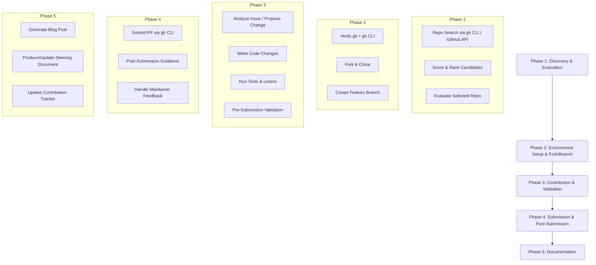

# Design Document: Open-Source Contribution Workflow

## Overview

This design describes how Kiro orchestrates an interactive, multi-phase workflow that guides a beginner Python programmer through discovering, evaluating, contributing to, and documenting open-source GitHub repositories. Kiro itself is the execution engine — there is no standalone application to build. The "components" are logical phases that Kiro executes conversationally with the user, using its built-in file editing, terminal execution (cmd on Windows), web search/fetch, and the `gh` CLI.

The workflow is sequential but re-entrant: the user can stop at any phase and resume later. State is persisted as simple JSON files in the workspace. The final deliverable includes the contribution itself (a merged or submitted PR), a blog post, and a reusable steering document at `~/.kiro/steering/open-source-contribution.md`.

### Design Decisions

| Decision | Rationale |
|----------|-----------|
| JSON files for state tracking | Simple, human-readable, no dependencies; workspace-portable |
| `gh` CLI as the primary GitHub interface | Already required for fork/PR operations; avoids raw API token handling |
| Composite scoring for repo ranking | Balances recency, approachability, and size into a single sort key |
| Conventional Commits format | Industry standard; makes commit messages machine-parseable for validation |
| Steering document as output | Enables repeatable workflow across any workspace without re-prompting |

## Architecture

The workflow is organized into four logical phases executed sequentially by Kiro:



### Execution Model

Kiro executes each phase interactively:
1. Kiro performs actions (terminal commands, file reads, web searches) and presents results.
2. The user makes decisions (which repo, which issue, approve proposed change).
3. Kiro proceeds based on user decisions.

All shell commands target **Windows cmd** as the default shell. Commands are non-interactive and use proper quoting for cmd.

## Components and Interfaces

Since Kiro is the execution engine, "components" are logical modules — sets of related behaviors grouped by phase. Each module defines what Kiro does, what inputs it needs, and what outputs it produces.

### Module 1: Repo_Scanner

**Responsibility:** Search GitHub for candidate Python repositories matching user interests, score them, and present ranked results.

**Inputs:**
- `interest_areas`: Array of 1-5 keyword strings (2-50 chars each)
- `difficulty_filter`: Optional — "beginner" | "intermediate" | "advanced"

**Process:**
1. Execute `gh search repos --language=python --sort=updated --limit=50` with keyword queries built from interest areas.
2. For each result, fetch metadata: stars, last commit date, open issues count, presence of CONTRIBUTING.md, line count of main package.
3. Filter: exclude repos with >5000 lines in main package directory.
4. Filter: include repos with issues labeled "good first issue", "help wanted", or "beginner-friendly" — or with issues matching contribution-type keywords.
5. Score using composite formula.
6. For each top candidate, identify a specific contribution opportunity (an issue to fix, a doc to improve, a test to add) so the user has a ready-to-execute queue.
7. Return top 10 sorted by score descending, each with its proposed contribution.

**Outputs:**
- List of `CandidateRepo` objects (see Data Models)

**Error Handling:**
- GitHub API unavailable → display retry message, wait 30 seconds, retry once.
- Zero results → suggest broadening interest areas.

### Module 2: Repo_Evaluator

**Responsibility:** Deep-dive analysis of a selected repository to assess suitability.

**Inputs:**
- `repo_full_name`: string (e.g., "owner/repo-name")

**Process:**
1. Clone repo to temp directory (shallow clone, depth=1).
2. Count lines of code (exclude tests/, docs/, config files).
3. Count files, detect test directory presence.
4. Parse dependency files (requirements.txt, setup.py, pyproject.toml) to count dependencies.
5. Check for LICENSE file and validate against known OSI-approved license identifiers.
6. Check for CONTRIBUTING.md or README contribution section.
7. Classify difficulty: easy/medium/hard based on rules.

**Outputs:**
- `RepoEvaluation` object (see Data Models)

### Module 3: Environment_Checker

**Responsibility:** Verify prerequisites and guide installation if needed.

**Inputs:** None (reads system state)

**Process:**
1. Run `git --version` — check exit code.
2. Run `git config user.name` and `git config user.email` — check non-empty.
3. Run `gh --version` — check exit code.
4. Run `gh auth status` — check authenticated.
5. Report results; provide remediation instructions for any failures.

**Outputs:**
- `EnvironmentStatus` object with per-tool pass/fail and version strings.

### Module 4: Fork_Branch_Manager

**Responsibility:** Fork, clone, configure remotes, create feature branch.

**Inputs:**
- `repo_full_name`: string
- `contribution_type`: string
- `short_description`: string

**Process:**
1. Check if fork exists: `gh repo list --fork --json nameWithOwner`.
2. If fork exists, sync: `gh repo sync owner/repo`.
3. If no fork, create: `gh repo fork owner/repo --clone`.
4. If fork existed, clone it.
5. Add upstream remote: `git remote add upstream <original_url>`.
6. Create branch: `git checkout -b <contribution_type>/<short_description>`.

**Outputs:**
- Local working directory path, branch name.

### Module 5: Contribution_Engine

**Responsibility:** Analyze the issue, propose a change, make modifications, and validate.

**Inputs:**
- Local repo path, target issue or improvement area.

**Process:**
1. Read issue details (if issue-based) or scan code for improvement opportunities.
2. Propose a scoped change completable in under 30 minutes (including the PR process). Even single-line changes are valid if they provide genuine value (fixing a typo in docs, adding a missing import, improving an error message).
3. Present proposal to user; wait for approval.
4. Make code changes following existing style (detect linter configs).
5. Run test suite: look for pytest/unittest/tox config, execute.
6. Run linter if config detected.
7. Stage, commit (conventional format), push to fork.

**Outputs:**
- Commit SHA, modified file list, test results.

### Module 6: Validation_Engine

**Responsibility:** Pre-submission quality checklist.

**Inputs:**
- Local repo path, branch name, target branch.

**Process:**
1. Check code style: run detected linter.
2. Check tests pass.
3. Check commit message format (conventional commits or repo-specific).
4. Check branch cleanliness: no untracked files, no merge conflicts, linear history.
5. Check for unintended file modifications outside expected directories.
6. Report all failures with remediation steps.

**Outputs:**
- `ValidationResult` — list of checks with pass/fail and remediation text.

### Module 7: PR_Submitter

**Responsibility:** Create and submit Pull Request.

**Inputs:**
- Fork branch, target repo, contribution metadata.

**Process:**
1. Check for merge conflicts with target branch.
2. Detect PR template in target repo (.github/PULL_REQUEST_TEMPLATE.md).
3. Generate PR title: `<type>: <short description>` (≤72 chars).
4. Generate PR body following template or default structure.
5. Submit: `gh pr create --base <default_branch> --title "..." --body "..."`.
6. Add labels if permitted.

**Outputs:**
- PR URL, PR number.

### Module 8: Blog_Generator

**Responsibility:** Produce a markdown blog post documenting the contribution journey.

**Inputs:**
- Contribution tracker data (repos, PRs, dates, code snippets).

**Process:**
1. Assemble contribution history from tracker.
2. Structure blog: intro, discovery, contribution walkthrough, lessons learned, next steps.
3. Include specific examples with repo names, PR links, code snippets.
4. Write in first person, conversational tone, define jargon inline.
5. Save as `blog-post-YYYY-MM-DD.md` in workspace.

**Outputs:**
- Blog post file path. Content 500-3000 words.

### Module 9: Steering_Document_Generator

**Responsibility:** Produce/update the reusable steering file.

**Inputs:**
- Contribution history, workflow improvements identified.

**Process:**
1. Generate steering document with front-matter (`inclusion: manual`).
2. Include configurable parameters at top (interests, difficulty, time budget).
3. Write step-by-step workflow directives in second person ("you shall...").
4. Save to `~/.kiro/steering/open-source-contribution.md`.
5. On subsequent contributions, update with lessons learned.

**Outputs:**
- Steering file path.

## Data Models

All state is stored as JSON files in the workspace directory `.kiro/specs/open-source-contribution-workflow/state/`.

### CandidateRepo

```json
{
  "full_name": "owner/repo-name",
  "description": "A short description (max 200 chars)",
  "stars": 42,
  "last_commit_date": "2025-01-15T10:30:00Z",
  "open_issues_count": 7,
  "has_contributing_md": true,
  "main_package_lines": 1200,
  "contribution_types": ["bug_fix", "test_addition"],
  "proposed_contribution": {
    "type": "bug_fix",
    "issue_number": 12,
    "issue_title": "Division by zero when input is empty",
    "summary": "Add a guard clause to validate non-empty input in calculate()"
  },
  "difficulty_level": "beginner",
  "composite_score": 78.5,
  "good_first_issue_count": 3,
  "dependency_count": 2
}
```

### RepoEvaluation

```json
{
  "full_name": "owner/repo-name",
  "total_lines": 1200,
  "file_count": 15,
  "has_tests": true,
  "dependency_count": 2,
  "difficulty_level": "easy",
  "license": "MIT",
  "license_verified": true,
  "has_contributing_guide": true,
  "contributing_summary": "Submit PRs against main branch. Run pytest before submitting.",
  "evaluated_at": "2025-01-20T14:00:00Z"
}
```

### ContributionRecord

```json
{
  "id": "contrib-001",
  "repo_full_name": "owner/repo-name",
  "contribution_type": "bug_fix",
  "difficulty_level": "easy",
  "branch_name": "fix/add-input-validation",
  "pr_url": "https://github.com/owner/repo-name/pull/42",
  "pr_number": 42,
  "pr_status": "open",
  "commit_sha": "abc1234",
  "modified_files": ["src/validator.py"],
  "code_snippet": "def validate_input(data):\n    if not data:\n        raise ValueError('Input required')",
  "started_at": "2025-01-20T14:30:00Z",
  "completed_at": "2025-01-20T15:00:00Z"
}
```

### ContributionTracker

```json
{
  "user_level": "beginner",
  "contributions": [],
  "level_counts": {
    "easy": 0,
    "medium": 0,
    "hard": 0
  },
  "interest_areas": ["web scraping", "CLI tools"],
  "last_updated": "2025-01-20T14:00:00Z"
}
```

### EnvironmentStatus

```json
{
  "git_installed": true,
  "git_version": "2.43.0",
  "git_user_configured": true,
  "gh_installed": true,
  "gh_version": "2.40.1",
  "gh_authenticated": true,
  "all_checks_passed": true,
  "checked_at": "2025-01-20T14:00:00Z"
}
```

### ValidationResult

```json
{
  "checks": [
    {
      "name": "code_style",
      "passed": true,
      "details": null
    },
    {
      "name": "tests_pass",
      "passed": false,
      "details": "test_validator.py::test_empty_input FAILED",
      "remediation": "The test expects a ValueError but your function returns None. Add a raise statement."
    }
  ],
  "all_passed": false,
  "checked_at": "2025-01-20T15:00:00Z"
}
```

### CompositeScoring Formula

```
score = (recent_commits_weight * min(commits_last_90_days, 50) / 50 * 25)
      + (contributing_md_present * 20)
      + (open_issues_weight * min(open_issues, 20) / 20 * 25)
      + (size_weight * (1 - min(main_package_lines, 5000) / 5000) * 30)
```

Where:
- `recent_commits_weight` = 25 points max (more recent activity = higher score)
- `contributing_md_present` = 20 points (binary: yes/no)
- `open_issues_weight` = 25 points max (more issues = more opportunity)
- `size_weight` = 30 points max (fewer lines = easier entry)

## Correctness Properties

*A property is a characteristic or behavior that should hold true across all valid executions of a system — essentially, a formal statement about what the system should do. Properties serve as the bridge between human-readable specifications and machine-verifiable correctness guarantees.*

### Property 1: Candidate Filtering Correctness

*For any* set of repository metadata and any combination of issue labels and issue body/title text, the filter function SHALL return only repositories that either (a) have at least one issue labeled "good first issue", "help wanted", or "beginner-friendly", or (b) have open issues whose title or body matches at least one Contribution_Type keyword — and SHALL never return a repository satisfying neither condition.

**Validates: Requirements 1.2, 1.3**

### Property 2: Composite Score Sorting and Cap

*For any* list of candidate repositories with valid metadata, the scoring and ranking function SHALL return results sorted in strictly non-increasing order of composite score, and SHALL return no more than 10 results.

**Validates: Requirements 1.4**

### Property 3: Candidate Display Completeness

*For any* CandidateRepo object with all fields populated, the display/format function SHALL produce output containing the repository name, description (≤200 characters), star count, last commit date, primary Contribution_Type opportunities, and Difficulty_Level.

**Validates: Requirements 1.5**

### Property 4: Difficulty Classification Boundaries

*For any* repository with a given dependency count, line count, and native extension presence, the classification function SHALL assign exactly one difficulty level, and SHALL assign "easy" when dependencies ≤ 1 AND lines < 1000 AND no native extensions, "medium" when dependencies 2-5 AND lines 1000-3000, and "hard" when dependencies > 5 OR has native extensions OR lines > 3000. When the classified difficulty exceeds the user's current level, the engine SHALL produce a warning.

**Validates: Requirements 2.2, 2.3**

### Property 5: License Detection Accuracy

*For any* LICENSE file content that contains a known OSI-approved license identifier (MIT, Apache-2.0, GPL-3.0, BSD-2-Clause, BSD-3-Clause, ISC, MPL-2.0), the detection function SHALL return `license_verified: true` with the correct identifier. For any content not matching a known identifier, it SHALL return `license_verified: false`.

**Validates: Requirements 2.5**

### Property 6: Contributing Summary Word Count

*For any* CONTRIBUTING.md file content (including empty and very long texts), the summarization function SHALL produce a summary of no more than 200 words.

**Validates: Requirements 2.7**

### Property 7: Branch Name Format and Length

*For any* contribution type string and short description string, the branch name generator SHALL produce a name matching the pattern `<contribution-type>/<short-description>` that is no longer than 50 characters total, contains only lowercase alphanumeric characters, hyphens, and the single separator slash.

**Validates: Requirements 4.4**

### Property 8: Commit Message Round-Trip

*For any* valid conventional commit type, optional scope, and subject line, the commit message generator SHALL produce a message that passes the commit message validator. Conversely, for any string that does not match the conventional commit format (type, optional scope in parentheses, colon, space, subject ≤72 characters), the validator SHALL reject it.

**Validates: Requirements 5.7, 9.3**

### Property 9: PR Title Format and Length

*For any* contribution type and short description, the PR title generator SHALL produce a title matching the format `<type>: <description>` that does not exceed 72 characters.

**Validates: Requirements 6.1**

### Property 10: PR Description Completeness

*For any* contribution metadata (change summary, motivation, test method, related issue), the PR description generator SHALL produce a description containing all four required sections: summary, motivation, testing approach, and issue reference.

**Validates: Requirements 6.2**

### Property 11: Difficulty Progression Logic

*For any* contribution history, the progression recommender SHALL suggest the same difficulty level until the user has completed at least 2 contributions at that level, after which it SHALL suggest the next higher level. The recommendation SHALL reference the Contribution_Type of the most recent completed contribution.

**Validates: Requirements 7.2, 7.3**

### Property 12: Contribution Tracking Round-Trip

*For any* valid ContributionRecord, adding it to the tracker and then retrieving contributions SHALL return a record with all original fields preserved (repo name, type, difficulty, branch, PR URL, dates). When a PR merge event is recorded, the level count for that difficulty SHALL increase by exactly 1.

**Validates: Requirements 7.4, 11.3**

### Property 13: Blog Structure and Content Completeness

*For any* non-empty set of contribution records, the blog generator SHALL produce a markdown document containing sections in order (introduction, discovery process, contribution process, what was learned, next steps), include for each contribution the repository name, PR link, and a code snippet, and save with filename matching the pattern `blog-post-YYYY-MM-DD.md`.

**Validates: Requirements 8.2, 8.4, 8.7**

### Property 14: Blog Word Count Bounds

*For any* non-empty set of contribution records, the blog generator SHALL produce a document with a word count between 500 and 3000 inclusive.

**Validates: Requirements 8.8**

### Property 15: Validation Aggregation

*For any* combination of individual validation check results (code style, tests, commit format, branch cleanliness), the overall validation SHALL report "all passed" if and only if every individual check passes. If any check fails, the overall result SHALL be "not all passed".

**Validates: Requirements 9.1**

### Property 16: Validation Failure Reporting

*For any* set of validation results where at least one check has failed, the reporting function SHALL include for each failed check both the check name and a non-empty remediation instruction.

**Validates: Requirements 9.2**

### Property 17: Out-of-Scope File Detection

*For any* set of modified file paths and a set of expected directories, the detection function SHALL flag every file path that does not have any expected directory as a prefix, and SHALL not flag any file that is within an expected directory.

**Validates: Requirements 9.4**

### Property 18: Steering Document Structure Completeness

*For any* set of workflow parameters (interest areas, difficulty level, time budget), the steering document generator SHALL produce a document containing all workflow phases (discovery, evaluation, environment check, fork/branch, make changes, validate, submit PR, post-submission) and include all configurable parameters in the header section.

**Validates: Requirements 10.2, 10.6**

### Property 19: Linter Config Detection

*For any* directory listing containing a subset of known linter configuration files (pyproject.toml with [tool.black] or [tool.ruff], setup.cfg with [flake8], .flake8, .pylintrc), the detection function SHALL identify the correct linter tool associated with each config file present, and SHALL return an empty result when no linter configs are found.

**Validates: Requirements 5.3**

## Error Handling

### Error Categories and Responses

| Error Category | Trigger | Response | Recovery |
|----------------|---------|----------|----------|
| GitHub API failure | Network timeout, 5xx, rate limit | Display "service temporarily unavailable", suggest retry in 30s | Automatic retry once after 30s |
| gh CLI not installed | `gh --version` fails | Provide platform-specific install instructions | User installs, re-runs check |
| git not configured | Missing user.name/user.email | Provide `git config` commands | User configures, re-runs check |
| No matching repos | Zero search results after filtering | Suggest broadening interest areas | User adjusts keywords |
| License not found | No LICENSE file or unrecognized content | Warn user, flag repo as unverified | User decides whether to proceed |
| Test suite failure | Tests fail after code changes | Identify failing tests, explain cause, suggest fix | User fixes, re-validates |
| Merge conflicts | Fork branch diverged from upstream | Notify user, provide rebase/merge instructions | User resolves, re-pushes |
| Validation failure | Any pre-submission check fails | Show check name + remediation | User fixes, re-validates |
| Validation infra unavailable | Linter/test runner not accessible | Inform user which step failed, block submission | User fixes environment, retries |
| Incomplete contribution data | Missing PR link or repo name for blog | Use placeholders, note what's missing | User can fill in later |

### Graceful Degradation Strategy

1. **External service failures** (GitHub API): Retry once automatically, then surface error to user with clear next steps.
2. **Tool availability**: Always check prerequisites before attempting operations. Provide install/configure instructions for missing tools.
3. **Data integrity**: Validate JSON state files before reading. If corrupted, offer to reset tracker with user confirmation.
4. **Timeout handling**: Test suite execution has a 300-second default timeout. If exceeded, abort and report which tests were still running.

## Testing Strategy

### Unit Tests (Example-Based)

Unit tests cover specific scenarios, error paths, and edge cases:

- **Environment checks**: Mock shell command outputs for installed/not-installed/not-configured states
- **Error paths**: API failures, missing files, invalid inputs
- **Edge cases**: Empty search results, no license file, no CONTRIBUTING.md, missing contribution data
- **Static content**: PR rejection reasons, post-submission guidance, notification instructions
- **Template handling**: PR template detection and format following

### Property-Based Tests

Property-based tests verify universal correctness properties using generated inputs. Each property test runs a minimum of **100 iterations** with randomized inputs.

**Library:** [Hypothesis](https://hypothesis.readthedocs.io/) (Python's standard PBT library)

**Configuration:**
- Minimum 100 examples per property
- Each test tagged with: `# Feature: open-source-contribution-workflow, Property {N}: {title}`

**Properties to implement:**
1. Candidate filtering (labels + keyword matching)
2. Composite score sorting and cap
3. Candidate display completeness
4. Difficulty classification boundaries
5. License detection accuracy
6. Contributing summary word count
7. Branch name format and length
8. Commit message round-trip (generate → validate)
9. PR title format and length
10. PR description completeness
11. Difficulty progression logic
12. Contribution tracking round-trip
13. Blog structure and content completeness
14. Blog word count bounds
15. Validation aggregation
16. Validation failure reporting
17. Out-of-scope file detection
18. Steering document structure completeness
19. Linter config detection

### Integration Tests

Integration tests verify interactions with external tools and services:

- **gh CLI operations**: fork, clone, PR creation (against a test repo)
- **git operations**: branch creation, commit, push
- **Test suite execution**: running pytest/unittest in a fixture repo
- **File I/O**: Blog post and steering document file creation

### Test Organization

```
tests/
├── unit/
│   ├── test_environment_checks.py
│   ├── test_error_handling.py
│   └── test_edge_cases.py
├── property/
│   ├── test_filtering.py          # Properties 1-3
│   ├── test_classification.py     # Properties 4-6
│   ├── test_naming.py             # Properties 7-9
│   ├── test_pr_generation.py      # Property 10
│   ├── test_progression.py        # Properties 11-12
│   ├── test_blog_generation.py    # Properties 13-14
│   ├── test_validation.py         # Properties 15-17
│   ├── test_steering.py           # Property 18
│   └── test_linter_detection.py   # Property 19
└── integration/
    ├── test_gh_operations.py
    ├── test_git_operations.py
    └── test_file_output.py
```

